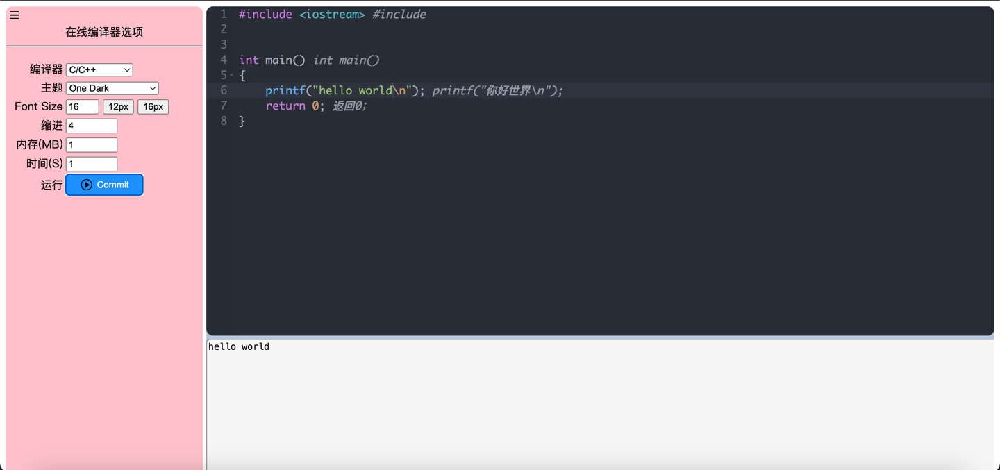

# SimpleOnlineCompiler

简易在线编译器，用于学习。

**第三方库**

```shell
# 后端
c_cpp-httplib、jsoncpp、spdlog

# 前端
jquery、ace
```

**使用方法**

对于部分语言如C#，可能需要创建运行环境，所以得先在template文件夹创建它的初始化环境。

**构建**
```shell
madir build && cd build && cmake .. && cmake
cd ..
./build/main
```

**效果展示**

